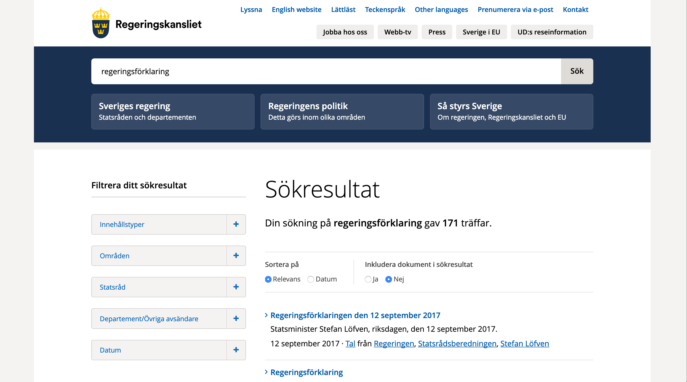

```{r setup, include=FALSE}
options(htmltools.dir.version = FALSE)
knitr::opts_chunk$set(echo = TRUE, dpi = 300)
```
```{r xaringan-themer, include = FALSE}
library(xaringanthemer)
mono_light(
  base_color = "#e85112",
  header_font_google = google_font("Arial"),
  text_font_google   = google_font("Arial", "300", "300i"),
  code_font_google   = google_font("Droid Mono"),
  header_h1_font_size = "45px",
  text_font_size = "40px",
  code_font_size = "20px"
  
)
```

# Vad är en regeringsförklaring? &#x1F937;

---

# Var finns regeringsförklaringen? 



---

# Efter en del kodande och mycket copy paste

```{r ladda_data, message=FALSE, warning=FALSE}
library(tidyverse)
regf <- read_csv("regf.csv")
```

---

# En data.frame med stycke, datum och statsminister

```{r echo=FALSE}
regf
```

---
# Vad är vi intresserade av?
--

- Vilka ord som nämns

--

- Hur regeringsförklaringen ändrats över tid

--

- Vilka ord som är viktigast

---

# För att analysera text behöver den vara tidy

--
- Varje variabel är en kolumn

--
- Varje observation är en rad

--
- I vårt fall handlar det om varje ord ska vara uppdelat per statsminister och regeringsförklaring

--
- Data är alltså inte tidy

---

# Vansinnigt enkelt att göra text tidy med `tidytext`

```{r}
library(tidytext)
tidy_regf <- regf %>%
  filter(!str_detect(text, "Regeringsförklaring")) %>%
  unnest_tokens(ord, text) #<<
```

---

# Tidy text data

```{r echo=FALSE}
tidy_regf
```

---

# Stoppord &#x1F640;

- Ord som *och*, *så*, *att* och så vidare
- Finns lista i :
```{r}
get_stopwords(language = "sv", source = "snowball")
```
---
# Stoppord &#x1F640;

- Kompletterar med lista från forskaren [Peter Dahlgren](https://gist.github.com/peterdalle/8865eb918a824a475b7ac5561f2f88e9) från Göteborgs universitet

```{r}
sv_stoppord <- read_csv("https://gist.githubusercontent.com/peterdalle/8865eb918a824a475b7ac5561f2f88e9/raw/cc1d05616e489576c1b934289711f041ff9b2281/swedish-stopwords.txt", col_names = FALSE) %>%
  rename(stoppord = X1)
```

---

# Tvätta data

```{r}
tvättade_regf <- tidy_regf %>%
  filter(!str_detect(ord, "[[:digit:]]")) %>% #<<
  anti_join(get_stopwords(language = "sv"), by = c("ord" = "word")) %>%
  anti_join(sv_stoppord, by = c("ord" = "stoppord"))
```

---

# Tvätta data

```{r eval=FALSE}
tvättade_regf <- tidy_regf %>%
  filter(!str_detect(ord, "[[:digit:]]")) %>% 
  anti_join(get_stopwords(language = "sv"), by = c("ord" = "word")) %>% #<<
  anti_join(sv_stoppord, by = c("ord" = "stoppord"))
```

---

# Tvätta data

```{r eval=FALSE}
tvättade_regf <- tidy_regf %>%
  filter(!str_detect(ord, "[[:digit:]]")) %>% 
  anti_join(get_stopwords(language = "sv"), by = c("ord" = "word")) %>% 
  anti_join(sv_stoppord, by = c("ord" = "stoppord")) #<<
```

---

```{r echo=FALSE, fig.width=12,fig.height=8}
text_theme <- function(){
  theme(
  axis.text.x = element_text(size = 20),
  axis.text.y = element_text(size = 20),  
  axis.title.x = element_text(size = 25),
  axis.title.y = element_text(size = 25),
  plot.title = element_text(size = 30),
  plot.subtitle = element_text(size = 25),
  plot.background = element_rect(fill = "#fcede7", color = "#fcede7"),
   panel.grid.major = element_line(color = "darkgrey"),
  panel.grid.minor = element_line(color = "grey")
  )
}

tvättade_regf %>%
  count(ord, sort = TRUE) %>%
  head(10) %>%
  ggplot(aes(x = reorder(ord, n), y = n, fill = ord)) +
  geom_col() +
  coord_flip() +
  theme_minimal() +
  text_theme() +
  labs(title = "Vanligast ord i svenska regeringsförklaringar",
       subtitle = "1976-2018",
       x = "Ord", y = "Antal ord", caption = "Källa: regeringen.se") +
  scale_fill_viridis_d(guide = FALSE)
```
                                    
---


                                    
                                    
                                    
                                    