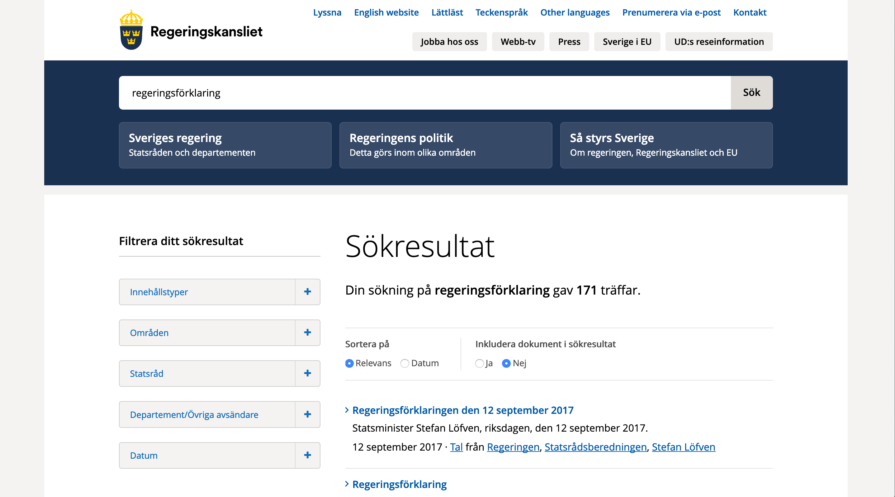

```{r setup, include=FALSE}
options(htmltools.dir.version = FALSE)
knitr::opts_chunk$set(echo = TRUE, dpi = 300)
```
```{r xaringan-themer, include = FALSE}
library(xaringanthemer)
mono_light(
  base_color = "#e85112",
  header_font_google = google_font("Arial"),
  text_font_google   = google_font("Arial", "300", "300i"),
  code_font_google   = google_font("Droid Mono"),
  header_h1_font_size = "45px",
  text_font_size = "40px",
  code_font_size = "20px"
  
)
```

# Vad är en regeringsförklaring? &#x1F937;

---

# Var finns regeringsförklaringen? 



---

# Efter en del kodande och mycket copy paste

```{r ladda_data, message=FALSE, warning=FALSE}
library(tidyverse)
regf <- read_csv("data/regf.csv")
```

---

# En data.frame med stycke, datum och statsminister

```{r echo=FALSE}
regf
```

---
# Vad är vi intresserade av?
--

- Vilka ord som nämns

--

- Hur regeringsförklaringen ändrats över tid

--

- Vilka ord som är viktigast

---

# För att analysera text behöver den vara tidy

--
- Varje variabel är en kolumn

--
- Varje observation är en rad

--
- I vårt fall handlar det om varje ord ska vara uppdelat per statsminister och regeringsförklaring

--
- Data är alltså inte tidy

---

# Vansinnigt enkelt att göra text tidy med `tidytext`

```{r}
library(tidytext)
tidy_regf <- regf %>%
  filter(!str_detect(text, "Regeringsförklaring")) %>%
  unnest_tokens(ord, text) #<<
```

---

# Tidy text data

```{r echo=FALSE}
tidy_regf
```

---

# Stoppord &#x1F640;

- Ord som *och*, *så*, *att* och så vidare
- Finns lista i :
```{r}
get_stopwords(language = "sv", source = "snowball")
```
---
# Stoppord &#x1F640;

- Kompletterar med lista från forskaren [Peter Dahlgren](https://gist.github.com/peterdalle/8865eb918a824a475b7ac5561f2f88e9) från Göteborgs universitet

```{r}
sv_stoppord <- read_csv("https://gist.githubusercontent.com/peterdalle/8865eb918a824a475b7ac5561f2f88e9/raw/cc1d05616e489576c1b934289711f041ff9b2281/swedish-stopwords.txt", col_names = FALSE) %>%
  rename(stoppord = X1)
```

---

# Tvätta data

```{r}
tvättade_regf <- tidy_regf %>%
  filter(!str_detect(ord, "[[:digit:]]")) %>% #<<
  anti_join(get_stopwords(language = "sv"), by = c("ord" = "word")) %>%
  anti_join(sv_stoppord, by = c("ord" = "stoppord"))
```

---

# Tvätta data

```{r eval=FALSE}
tvättade_regf <- tidy_regf %>%
  filter(!str_detect(ord, "[[:digit:]]")) %>% 
  anti_join(get_stopwords(language = "sv"), by = c("ord" = "word")) %>% #<<
  anti_join(sv_stoppord, by = c("ord" = "stoppord"))
```

---

# Tvätta data

```{r eval=FALSE}
tvättade_regf <- tidy_regf %>%
  filter(!str_detect(ord, "[[:digit:]]")) %>% 
  anti_join(get_stopwords(language = "sv"), by = c("ord" = "word")) %>% 
  anti_join(sv_stoppord, by = c("ord" = "stoppord")) #<<
```

---

```{r echo=FALSE, fig.width=12,fig.height=8}
text_theme <- function(){
  theme(
  axis.text.x = element_text(size = 20),
  axis.text.y = element_text(size = 20),  
  axis.title.x = element_text(size = 25),
  axis.title.y = element_text(size = 25),
  plot.title = element_text(size = 30),
  plot.subtitle = element_text(size = 25),
  strip.text.x = element_text(size = 20),
  plot.background = element_rect(fill = "#fcede7", color = "#fcede7"),
   panel.grid.major = element_line(color = "darkgrey"),
  panel.grid.minor = element_line(color = "grey")
  )
}

tvättade_regf %>%
  count(ord, sort = TRUE) %>%
  head(10) %>%
  ggplot(aes(x = reorder(ord, n), y = n, fill = ord)) +
  geom_col() +
  coord_flip() +
  theme_minimal() +
  text_theme() +
  labs(title = "Vanligast ord i svenska regeringsförklaringar",
       subtitle = "1976-2018",
       x = "Ord", y = "Antal ord", caption = "Källa: regeringen.se") +
  scale_fill_viridis_d(guide = FALSE)
```
                                    
---

```{r echo=FALSE, message=FALSE, fig.height = 10, fig.width = 16}
tvättade_regf %>%
  group_by(statsminister) %>%
  count(ord) %>%
  top_n(n = 10) %>%
  ggplot(aes(x = drlib::reorder_within(ord, n, statsminister), y = n)) +
  geom_col() +
  drlib::scale_x_reordered() +
  facet_wrap(~statsminister, scales = "free") +
  coord_flip() +
  labs(x = "", y = "Antal ord") +
  text_theme()
```

---
```{r echo=FALSE, fig.height=5}
tvättade_regf %>%
  group_by(datum) %>%
  count(datum) %>%
  ggplot(aes(x = datum, y = n)) +
  geom_line() +
  geom_smooth(method = "loess") +
  theme_minimal() +
  text_theme() +
  labs(title = "Antal ord per regeringsförklaring över tid",
       y = "",
       x = "") +
  scale_y_continuous(limits = c(0,3500))
```

---

```{r echo=FALSE, fig.heigth = 4, fig.width = 11}
tvättade_regf %>%
  group_by(statsminister, datum) %>%
  summarise(antal_ord = n()) %>%
  group_by(statsminister) %>%
  summarise(mv_ord = mean(antal_ord)) %>% 
  ggplot(aes(x = reorder(statsminister, mv_ord),
             y = mv_ord, fill = statsminister)) +
  geom_col() +
  coord_flip() +
  labs(y = "Medelvärde antal ord",
       x = "",
       title = "Vem snackar mest?") +
  theme_minimal() +
  text_theme() +
  scale_fill_viridis_d() +
  guides(fill = FALSE)
```
                                    
---

```{r echo=FALSE, fig.width = 11, fig.heigth = 6, message=FALSE, warning=FALSE}
bigram_regf <- regf %>%
  filter(!is.na(statsminister)) %>%
  unnest_tokens(bigram, text, token = "ngrams", n = 2)

library(tidyr)
bigrams_separated <- bigram_regf %>%
  separate(bigram, c("word1", "word2"), sep = " ")

bigrams_filtered <- bigrams_separated %>%
  filter_at(vars(word1, word2),
            all_vars(!. %in% sv_stoppord$stoppord))

# new bigram counts:
bigram_counts <- bigrams_filtered %>% 
  count(word1, word2, sort = TRUE)

bigrams_united <- bigrams_filtered %>%
  unite(bigram, word1, word2, sep = " ")

bigram_tf_idf <- bigrams_united %>%
  count(statsminister, bigram) %>%
  bind_tf_idf(bigram, statsminister, n) %>%
  arrange(desc(tf_idf))

library(igraph)
library(ggraph)
library(dplyr)
bigram_graph <- bigram_counts %>%
  filter(n > 15) %>%
  graph_from_data_frame()

set.seed(2017)

ggraph(bigram_graph, layout = "fr") +
  geom_edge_link() +
  geom_node_point(size = 3) +
  geom_node_text(aes(label = name), repel = TRUE, size = 8) +
  theme_void() +
  theme(plot.background = element_rect(fill = "#fcede7", color = "#fcede7"))
```

---

# Vilka är de viktigaste orden för respektive statsminister?

---

# Texten är skev!

- Zipfs law

```{r echo=FALSE, out.width = "300px", fig.align="center"}

```

---

```{r echo=FALSE, fig.height = 10, fig.width = 16, message=FALSE}
tvättade_regf %>%
  group_by(statsminister) %>%
  count(ord) %>%
  mutate(total = sum(n)) %>%
  ggplot(aes(n/total, fill = statsminister)) +
  geom_density(show.legend = FALSE) +
  facet_wrap(~statsminister, scales = "free_y") +
  theme_minimal() +
  text_theme() +
  scale_fill_viridis_d()
```

---

# Karen Spärck Jones 

```{r, out.width = "300px", echo=FALSE}
knitr::include_graphics("ds-meetup-presentation_files/figure-html/karen.jpg")
```

Foto Från: University of Cambridge, <a href="https://creativecommons.org/licenses/by/2.5" title="Creative Commons Attribution 2.5">CC BY 2.5</a> <a href="https://commons.wikimedia.org/w/index.php?curid=4734533"></a>

---

# Term frequency–inverse document frequency

$$ tf-idf(term) = tf(term) * idf(term) $$
--

$$ tf(term) = f_t$$

--


$$idf(\text{term}) = \ln{\left(\frac{n_{\text{documents}}}{n_{\text{documents containing term}}}\right)}$$
---

# Term frequency–inverse document frequency
 
- Skapar en vikt för ord baserat på hur ofta de förekommer i varje regeringsförklaring 

--

- Kombinera med *term frequency* och vi kan ta fram de "viktigaste" orden för repsektive statsminister
---

# Term frequency–inverse document frequency

- Exempel:

--

- Sveriges regering sätter kampen mot **arbetslösheten** främst

--

- Sverige regering sätter kampen mot **terrorism** främst

---

```{r echo=FALSE, fig.height = 10, fig.width = 16, message=FALSE}
tvättade_regf %>%
  group_by(statsminister) %>%
  count(ord) %>%
  bind_tf_idf(ord, statsminister, n) %>%
  top_n(n = 5) %>%
  ggplot(aes(x = drlib::reorder_within(ord, tf_idf, statsminister), y = tf_idf)) +
  geom_col() +
  drlib::scale_x_reordered() +
  facet_wrap(~statsminister, scales = "free") +
  coord_flip() +
  labs(x = "", y = "") +
  scale_fill_viridis_d() +
  text_theme()
```

---
- filip.wastberg@ferrologic.se
- All kod för presentationen: https://github.com/filipwastberg/regeringsforklaring


                                    